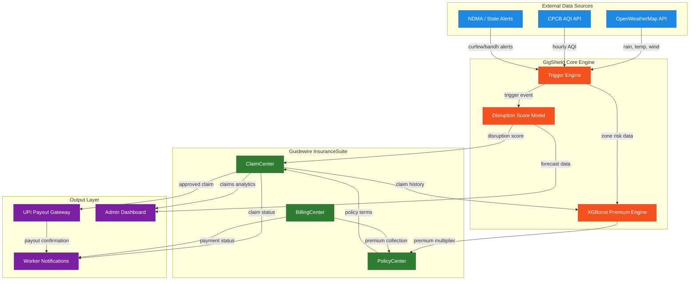
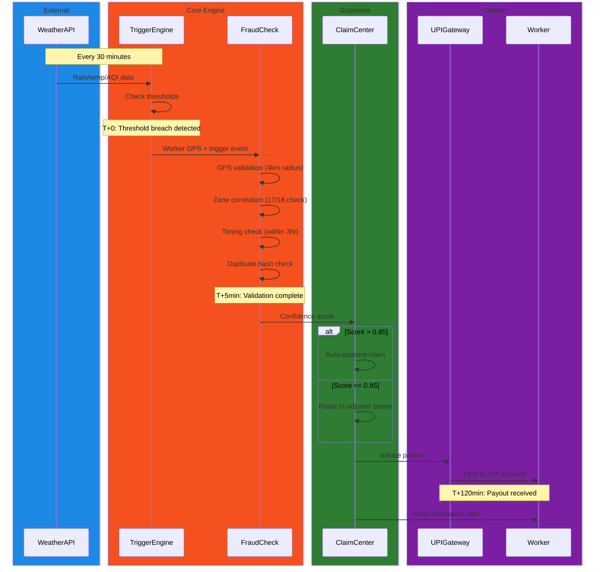

<div align="center">

# GigShield

### India's First Weekly Income Shield for Food Delivery Partners

_Personalised earnings velocity collapse protection for Swiggy and Zomato delivery workers_

**India's first weekly income shield for Swiggy and Zomato delivery partners that pays automatically when verified external disruptions wipe out their earning day, with zero paperwork.**

---

**Guidewire DEVTrails 2026 | Phase 1: Ideation**

</div>

---

## Table of Contents

1. [The Problem](#1-the-problem)
2. [Market Gap Analysis](#2-market-gap-analysis)
3. [Competitive Moat](#3-competitive-moat)
4. [Parametric Triggers](#4-parametric-triggers)
5. [Weekly Premium Model](#5-weekly-premium-model)
6. [AI/ML Integration](#6-aiml-integration)
7. [Fraud Detection](#7-fraud-detection)
8. [SmartShift Advisor](#8-smartshift-advisor)
9. [Insurer Admin Dashboard](#9-insurer-admin-dashboard)
10. [Guidewire Platform Integration](#10-guidewire-platform-integration)
11. [Reinsurance Strategy](#11-reinsurance-strategy)
12. [System Architecture](#12-system-architecture)
13. [Trigger-to-Payout Workflow](#13-trigger-to-payout-workflow)
14. [Tech Stack](#14-tech-stack)

---

## 1. The Problem

### Meet Rajan

Rajan is 27 years old and works as a Swiggy delivery partner out of the HSR Layout zone in Bengaluru. Under normal conditions he earns approximately ₹23,000 per month, roughly ₹800 per day across 29 working days. His effective active hourly rate during delivery windows is ₹120/hr, which is consistent with Zomato CEO Deepinder Goyal's published average of ₹102/hr across all logged hours: active delivery windows yield a higher rate because idle and waiting time is excluded.

Rajan's per-order economics break down as follows: ₹18 base pay per order, plus ₹2 per kilometre distance charge, plus a ₹100 daily bonus if he completes 20 orders. On a good day he finishes 22 to 24 orders. On a rainy day he manages 9 to 11 orders and misses the bonus entirely, losing both the per-order income and the ₹100 bonus in a single stroke.

His financial reality leaves no room for disruption. He sends ₹8,000 per month to his family. He pays ₹5,500 for shared accommodation in Bengaluru. After fuel (₹3,000), phone data (₹500), and bike maintenance (₹1,500), he has ₹2,500 remaining for emergencies. There is no savings buffer beyond two weeks. A single week of weather-disrupted earnings puts him behind on rent.

Swiggy provides Rajan with basic accidental injury coverage of ₹2 lakh through its platform insurance partner. This covers hospitalisation from road accidents. It covers zero rupees of income lost because delivery zones became unserviceable during heavy rain, because the AQI crossed hazardous thresholds, or because a government bandh shut down platform operations for an entire day.

GigShield exists to fill that gap. It covers income loss only from external disruptions: weather, pollution, and social disruptions such as government-imposed curfews. It strictly excludes health, life, accidents, and vehicle repairs. Those risks are already addressed by existing products. The income gap is not.

### Scenario A: Mumbai Monsoon

**Arjun, 24, Zomato partner, Dharavi zone, Mumbai.**

July 18, 2:00 PM. Rainfall in Dharavi crosses 30mm in three hours. Arjun has completed 12 of his 20-order target at 2 PM and is on pace for an ₹820 day. Zomato marks the Dharavi zone as reduced serviceability. Order flow drops to near zero. Arjun finishes the day at 15 orders, missing his ₹120 daily bonus. He earns ₹480 instead of ₹820, a loss of ₹340.

GigShield detects the rainfall trigger at 2:15 PM via the OpenWeatherMap API (`hourly.rain.1h` field exceeding 10mm/hr across three consecutive readings in Arjun's GPS zone). The system confirms Arjun's GPS was active in the affected zone at trigger time. By 4:00 PM, ₹300 (2.5 hours at ₹120/hr) lands in Arjun's UPI account. No app interaction was required from Arjun. No claim form. No phone call. The payout is calculated, validated, and disbursed entirely by the system.

### Scenario B: Delhi AQI Crisis

**Priya, 30, Swiggy partner, Dwarka, Delhi.**

November 6. At 11:00 AM, the AQI in Dwarka crosses 420. The Delhi government issues an outdoor activity advisory under GRAP Stage IV. Priya stops working at noon after completing 8 orders. Her entire afternoon earning window, typically worth ₹400 to ₹500, is eliminated.

GigShield detects the CPCB AQI reading crossing the 400 threshold, sustained for four consecutive hours across at least two monitoring stations in the Delhi zone. The system confirms Priya's GPS was active in the affected city zone during the trigger window. By 3:00 PM, ₹240 (2 hours at ₹120/hr) is in Priya's UPI account.

### Scenario C: Bengaluru Bandh

**Rajan, 27, Swiggy partner, HSR Layout, Bengaluru.**

A Tuesday morning. An unexpected bandh is called at 8:00 AM. All delivery platforms suspend operations across Bengaluru. Rajan loses a full working day worth ₹800.

GigShield detects the state-issued public advisory from the Karnataka government alert feed. The system cross-verifies against NDMA advisory data. A full-day payout of ₹480 (4 hours at ₹120/hr, capped per single-trigger rules) is released to Rajan's UPI. This is the trigger no other insurance product in India currently covers. Weather disruptions at least have seasonal predictability. A bandh has none.

---

## 2. Market Gap Analysis

### Existing Products and Their Gaps

| Product              | What It Covers                                                                                                                                          | Income Loss from Weather? | Income Loss from AQI? | Income Loss from Curfew/Bandh? | Weekly Premium?         | Parametric Triggers?   |
| -------------------- | ------------------------------------------------------------------------------------------------------------------------------------------------------- | ------------------------- | --------------------- | ------------------------------ | ----------------------- | ---------------------- |
| **Onsurity**         | Group health insurance for SMEs and startups. Monthly plans from ₹145/month. Requires employer-based payroll enrolment.                                 | No                        | No                    | No                             | No                      | No                     |
| **Toffee Insurance** | "Salary Protect Plan" (Kamai Bachao Yojana): ₹1,000/day income protection, but triggered only by hospitalisation. ₹449/year.                            | No                        | No                    | No                             | No                      | No (indemnity-based)   |
| **Acko**             | Accident and medical coverage for Swiggy/Zomato partners through platform partnerships. ₹10 lakh accidental death/disability. 11,000+ hospital network. | No                        | No                    | No                             | No (pay-per-day option) | No                     |
| **Digit Insurance**  | Parametric weather insurance settled for farmers (moisture index, 500+ farmers, January 2025). Not extended to gig workers.                             | No (farmers only)         | No                    | No                             | No                      | Yes (agriculture only) |
| **GigShield**        | **Income loss from weather, pollution, and social disruptions for food delivery workers**                                                               | **Yes**                   | **Yes**               | **Yes**                        | **Yes (₹159/week)**     | **Yes (5 triggers)**   |

**The confirmed gap:** After searching IRDAI product filings, insurance aggregator catalogues (PolicyBazaar, Coverfox), and all four companies listed above, no insurer in India has filed a parametric income loss product for gig workers triggered by environmental or social disruptions. Toffee's "Salary Protect" comes closest but covers income loss only from hospitalisation, not from rain, heat, pollution, or curfews. The gap is real, documented, and unoccupied.

### Regulatory Fit

GigShield operates within a regulatory framework that actively encourages this product category:

- **IRDAI (Insurance Products) Regulations 2024** explicitly encourage innovative parametric product design and have removed the separate micro-insurance product filing process, streamlining approval for novel low-premium products.
- **IRDAI Regulatory Sandbox Regulations 2025** provide the formal pathway for testing novel parametric products with a limited customer base over a 6-to-12-month period, with relaxed regulatory requirements during the sandbox phase.
- **Precedent exists.** Go Digit General Insurance settled India's first parametric weather insurance claim in January 2025 using a moisture index trigger, paying out to over 500 farmers across 30 villages. This proves IRDAI accepts parametric triggers based on objective, independently verifiable data sources.
- **No regulatory blocker exists** for extending parametric triggers from agriculture to gig-worker income protection. The product falls under general (non-life) insurance, not health or life, avoiding those regulators entirely.

---

## 3. Competitive Moat

Saying "no one does this today" is not a moat. Here are three structural reasons why Acko or Digit cannot replicate GigShield within six months, even with unlimited budget.

### 3.1 Data Network Effects

Every payout GigShield makes creates a labelled training record: the specific trigger event, GPS coordinates, trigger duration, actual income loss verified against zone peer order-completion rates, and claim outcome (approved, flagged, or rejected). After six months of operation with 10,000 active workers, GigShield holds the most accurate zone-level income-loss-versus-disruption dataset in India. No public dataset provides this correlation. A competitor starting today begins with zero labelled records and must operate for six or more months to accumulate comparable data. GigShield's XGBoost premium model and Disruption Score engine improve with every weekly refit. The accuracy gap between GigShield and a new entrant widens over time, it does not narrow.

### 3.2 Worker Lock-In via Personalised Pricing

Workers with 12 or more weeks of claims history in GigShield receive the most personalised premium, reflecting their actual zone risk exposure and individual claim frequency. Claim-free workers accumulate a cumulative discount (5% at week 12, increasing with continued clean history) that resets to zero if they switch to a competitor. A worker paying ₹97/week after 20 weeks of history would restart at ₹159/week with a new provider. The longer a worker stays, the cheaper their premium becomes. This is a structural retention mechanism that money alone cannot replicate.

### 3.3 Regulatory First-Mover Advantage

IRDAI sandbox approval takes 6 to 12 months from filing to operational clearance. Filing first occupies the regulatory slot for parametric gig-worker income protection. Neither Digit nor Acko has filed this product category as of March 2026. A six-to-twelve-month regulatory head start cannot be shortened by engineering speed or marketing budget. During that window, GigShield accumulates workers, data, and premium history that define market pricing for the category.

---

## 4. Parametric Triggers

GigShield defines five parametric triggers. Each trigger has an objective, independently verifiable data source, a specific threshold based on government or international definitions, and a payout calculated as a function of the worker's effective hourly rate of ₹120/hr.

### Trigger Summary

| #   | Trigger                   | Threshold                                                                                                                   | Source (API + field)                                                                                                 | Payout                   | Justification                                                                                                                                                                                                                                                                     |
| --- | ------------------------- | --------------------------------------------------------------------------------------------------------------------------- | -------------------------------------------------------------------------------------------------------------------- | ------------------------ | --------------------------------------------------------------------------------------------------------------------------------------------------------------------------------------------------------------------------------------------------------------------------------- |
| 1   | Heavy Rainfall            | >30mm cumulative in 3 consecutive hours, within worker's 5km GPS zone                                                       | OpenWeatherMap One Call API, `hourly.rain.1h` field, polled every 30 min per active zone                             | ₹300 (2.5 hrs x ₹120/hr) | IMD defines 30mm/3hr as the lower bound of heavy rain requiring public advisories. Below 30mm deliveries slow but continue. At 30mm+ platforms mark zones as reduced serviceability. This is the operational inflection point.                                                    |
| 2   | Extreme Heat              | `feels_like` >43°C for 3+ consecutive hours within 11am-4pm                                                                 | OpenWeatherMap current weather endpoint, `feels_like` field, polled hourly per city                                  | ₹360 (3 hrs x ₹120/hr)   | ILO defines 43°C wet-bulb equivalent as dangerous heat stress for outdoor workers. NDMA issued India's first gig worker heat advisory (July 2025) using this threshold. The 11am-4pm window targets the lunch surge; losing this window eliminates the day's second income spike. |
| 3   | Severe AQI                | AQI >400 (CPCB Severe) for 4+ consecutive hours, confirmed by at least 2 monitoring stations                                | CPCB AQI API via data.gov.in (free, hourly, station-level) + WAQI API as fallback                                    | ₹240 (2 hrs x ₹120/hr)   | Below 400 riders operate with discomfort. Above 400 GRAP Stage IV activates in Delhi NCR with vehicle restrictions and outdoor activity advisories. 2-station confirmation prevents a single faulty sensor from triggering payouts across a zone.                                 |
| 4   | Government Curfew / Bandh | State or district confirmed curfew, Section 144 order, or bandh advisory covering worker's city for 3+ hours during 8am-9pm | State government alert portals (Karnataka, Maharashtra, UP, Bihar, Telangana) + NDMA advisory API cross-verification | ₹480 (4 hrs x ₹120/hr)   | Platforms halt operations during confirmed Section 144 orders. Government advisory is objective, auditable, and public. Fraud on this trigger is structurally impossible because a worker cannot create or fake a government order.                                               |
| 5   | Compound Disruption Score | Disruption Score >7.0 sustained for 2+ hours, even if no single trigger above crosses its individual threshold              | Composite: OpenWeatherMap (rain, temp, wind) + CPCB AQI + Google Maps Routes API (traffic delay index)               | ₹300                     | 10mm/hr rain + AQI 350 + 2x traffic congestion = 60-70% earnings drop even though no single trigger fires. This is how income loss actually works for delivery workers. No other insurance product models compound disruption.                                                    |

**Compound Disruption Score formula:**

```
DS = w1 × R(rain) + w2 × T(temp) + w3 × A(aqi) + w4 × C(congestion) + interaction_terms
```

Each factor is normalised on a 0-10 scale. Weights `w1` through `w4` are learned via Gradient Boosted Trees trained on historical earnings-versus-conditions data. The `interaction_terms` capture compounding effects: rain multiplied by congestion produces a super-linear impact on earnings because flooded roads with existing traffic create multiplicative delays rather than additive ones.

### Cap Rules

| Rule                         | Detail                                                                                                                     |
| ---------------------------- | -------------------------------------------------------------------------------------------------------------------------- |
| **Maximum payouts per week** | 2 trigger payouts per worker per week                                                                                      |
| **Weekly payout ceiling**    | Total weekly payout capped at 55% of the worker's 4-week rolling earnings baseline                                         |
| **Overlapping triggers**     | If two triggers overlap in the same time window, only the higher-value trigger fires                                       |
| **Payout timing**            | Released within 2 hours of trigger confirmation, via UPI                                                                   |
| **Activity requirement**     | Worker must have been active on the delivery platform in the 2 hours preceding the trigger, verified via GPS activity logs |

---

## 5. Weekly Premium Model

### Base Premium: ₹159/week

The base premium is derived actuarially. Every number below is shown in full.

**Step 1: Events per year (India-wide weighted average per worker)**

Not every worker faces every trigger. AQI is heavily concentrated in Delhi NCR and parts of North India. Extreme heat above 43°C is specific to the north and central belt (Delhi, UP, Rajasthan, Bihar, MP, Nagpur), while coastal and southern metros rarely cross this threshold. The averages below reflect geographic concentration.

| Trigger                   | Events/year (weighted avg) |
| ------------------------- | -------------------------- |
| Heavy Rainfall            | 4                          |
| Extreme Heat              | 3                          |
| Severe AQI                | 2 (Delhi-weighted)         |
| Government Curfew/Bandh   | 1                          |
| Compound Disruption Score | 3                          |
| **Total**                 | **13 events/year**         |

**Step 2: Expected weekly loss**

```
Events per week     = 13 events/year ÷ 52 weeks = 0.25/week
Avg payout per event = (₹300 + ₹360 + ₹240 + ₹480 + ₹300) ÷ 5 = ₹336/event
Expected weekly loss = 0.25 × ₹336 = ₹84/week
```

**Step 3: Premium build-up**

```
Expected weekly loss  = ₹84
At 65% loss ratio     = ₹84 ÷ 0.65 = ₹129.23/week
Add 23% operating load = ₹129.23 × 1.23 = ₹158.96/week
Rounded for market     = ₹159/week
```

**Affordability check:** The ₹159 base rate applies before XGBoost personalisation. At ₹7,200/week (typical for a full-time worker in Mumbai or Delhi), ₹159 is 2.2% of gross income, below the 2.5% micro-insurance affordability ceiling. Rajan earns ₹5,750/week (₹23,000 ÷ 4). After XGBoost adjustment for Bengaluru and a low-disruption month, his personalised premium would be ₹97–₹120/week which is 1.7% to 2.1% of his earnings, well within the threshold. The model ensures no worker is priced above their affordability band.

---

### Worked Example A: Vikram (High Risk)

**Vikram, 26, Zomato partner, Andheri East, Mumbai. Month: July (peak monsoon).**

Earnings baseline: ₹8,400/week (₹1,200/day x 7 active days). Rating: 4.7. Zone flood risk score: 0.82 (Andheri East historically floods 6-8 times per year per BMC/MCGM data). Weekly hours: 62.

| Adjustment Factor                 | Value  | Multiplier | Running Premium |
| --------------------------------- | ------ | ---------- | --------------- |
| Base premium                      | -      | -          | ₹159            |
| City risk (Mumbai = High)         | High   | ×1.20      | ₹191            |
| Season (July = peak monsoon)      | Peak   | ×1.25      | ₹239            |
| Zone flood risk score             | 0.82   | ×1.10      | ₹262            |
| Platform rating                   | 4.7    | ×0.95      | ₹249            |
| Weekly hours (62 = high exposure) | 62 hrs | ×1.05      | ₹262            |
| Claims history (0 prior)          | 0      | ×0.92      | **₹241**        |

**Vikram's weekly premium: ₹240** (rounded). This is 2.9% of his ₹8,400 weekly earnings, below the 3% affordability ceiling.

---

### Worked Example B: Suresh (Low Risk)

**Suresh, 31, Swiggy partner, Secunderabad, Hyderabad. Month: February (dry season).**

Earnings baseline: ₹4,800/week (₹800/day x 6 active days). Rating: 3.8. Zone flood risk score: 0.21. Weekly hours: 36.

| Adjustment Factor                  | Value  | Multiplier | Running Premium |
| ---------------------------------- | ------ | ---------- | --------------- |
| Base premium                       | -      | -          | ₹159            |
| City risk (Hyderabad = Medium)     | Medium | ×0.90      | ₹143            |
| Season (February = dry/low risk)   | Low    | ×0.80      | ₹114            |
| Zone flood risk score              | 0.21   | ×0.92      | ₹105            |
| Platform rating                    | 3.8    | ×1.00      | ₹105            |
| Weekly hours (36 = lower exposure) | 36 hrs | ×0.95      | ₹100            |
| Claims history (0 prior)           | 0      | ×0.97      | **₹97**         |

**Suresh's weekly premium: ₹97.** This is 2.0% of his ₹4,800 weekly earnings.

**Vikram pays ₹240. Suresh pays ₹97.** Both premiums fall below 3% of weekly earnings. The ₹143 spread between them reflects genuine differences in city risk, seasonal exposure, zone flooding history, and logged hours, not arbitrary tiers.

---

## 6. AI/ML Integration

GigShield uses four distinct machine learning models, each with a named purpose, specific input features, and a defined retraining schedule.

### Model 1: XGBoost Gradient Boosted Trees for Dynamic Premium Engine

**Purpose:** Calculates the premium multiplier applied to the ₹159 base for each worker.

**Input features (7):**

| Feature                      | Type                        | Source                                                    |
| ---------------------------- | --------------------------- | --------------------------------------------------------- |
| `city`                       | One-hot encoded categorical | Worker onboarding form                                    |
| `month`                      | Integer 1-12                | System date                                               |
| `worker_weekly_baseline_inr` | Float                       | 4-week exponentially weighted rolling average of earnings |
| `zone_flood_risk_score`      | Float 0-1                   | GIS flood risk data (BMC/MCGM, BBMP, MCD sources)         |
| `zone_aqi_risk_score`        | Float 0-1                   | Historical CPCB AQI frequency data for the zone           |
| `platform_rating`            | Float 1-5                   | Swiggy/Zomato partner rating (self-reported, validated)   |
| `avg_weekly_hours_logged`    | Integer                     | Platform activity data                                    |

**Output:** Premium multiplier (float, bounded 0.5 to 2.0) applied to ₹159 base.

**Why XGBoost:** Handles tabular mixed-type data natively. Feature importance is interpretable via SHAP scores, meaning judges (and regulators) can see exactly what drives each worker's premium. Trains reliably on datasets as small as 500 records, which matters in week 1 of deployment when labelled data is scarce.

**Refit schedule:** Every Sunday night. Updated premiums apply to the following week's policy cycle.

---

### Model 2: Isolation Forest for Fraud Detection

**Purpose:** Flags workers whose claim patterns deviate from zone peers, without requiring labelled fraud examples.

**How it works:** Constructs an ensemble of random isolation trees on features including claim frequency, average hours between claims, payout amounts, and GPS movement variance. Workers whose feature vectors require fewer splits to isolate (anomaly score > 0.85 deviation) are flagged for manual review.

**Retrains weekly** as new claims data accumulates. Requires no labelled fraud data for Phase 1, making it deployable from day one.

---

### Model 3: Gradient Boosted Trees for Disruption Score Engine

**Purpose:** Calculates the real-time Compound Disruption Score that powers Trigger 5 and the SmartShift Advisor.

**Input features:** Rain intensity (normalised 0-10), temperature deviation from comfort zone (normalised 0-10), AQI severity (normalised 0-10), traffic delay ratio versus baseline (normalised 0-10), plus learned interaction terms (rain x congestion, heat x AQI).

**Training data:** Historical zone-level earnings (from platform activity proxies) correlated with simultaneous weather, AQI, and traffic conditions.

**Dual use:** The same model powers both real-time trigger detection (fed current data) and SmartShift 48-hour forecasting (fed forecast data).

---

### Model 4: LSTM for SmartShift Shift Quality Forecast

**Purpose:** Predicts disruption probability per 4-hour shift block over the next 48 hours.

**Input:** Sequences of 48-hour weather forecasts (temperature, rainfall probability, wind speed) and AQI forecasts from CPCB predictive data.

**Output:** Per-shift disruption probability (0-1) that feeds daily worker notifications (see [SmartShift Advisor](#8-smartshift-advisor)).

---

### Feedback Loop

The models are not static. Accuracy improves structurally over time:

| Phase                | Timeline  | What Changes                                                                                                                                                                     |
| -------------------- | --------- | -------------------------------------------------------------------------------------------------------------------------------------------------------------------------------- |
| Cold start           | Week 1-4  | Community-rated pricing using city + season only. No individual history available.                                                                                               |
| Pattern recognition  | Week 5-12 | Individual claim history incorporated into XGBoost features. Claim-free workers receive 5% discount. Workers with 2+ claims flagged for fraud review.                            |
| Full personalisation | Month 4+  | Model retrains monthly on actual trigger frequency versus predicted frequency, claim-to-trigger ratio (fraud signal), and worker churn data (are premiums too high?).            |
| Continuous           | Ongoing   | Bayesian updating of zone risk scores using real claims frequency. A zone scored 0.40 that triggers 8 payouts in 6 weeks automatically updates to 0.71 at the next Sunday refit. |

---

## 7. Fraud Detection

GigShield implements four fraud detection signals, each with specific parameters. Every claim passes through all four checks before payout.

### Signal 1: GPS Zone Validation

The worker's GPS position at trigger time must overlap with the zone where the trigger was detected. Radius tolerance is 4km. If the worker's last GPS ping before the trigger was in a non-disrupted zone more than 4km away, the claim is flagged for manual review. This catches workers who are outside the disrupted area but attempt to claim a zone-based payout.

### Signal 2: Multi-Worker Zone Correlation

If only 1 out of 18 workers active in a zone during a trigger window claims a payout, but the other 17 show normal order-completion rates, the single claim goes to manual review. Genuine weather suppresses orders for all workers in a zone. If orders were flowing normally for 17 workers, the triggering condition could not have caused income loss for the 18th.

### Signal 3: Timing Anomaly via Isolation Forest

Claims submitted more than 3 hours after the trigger window closes are flagged. Genuine income loss occurs during the event. Delayed claims suggest the worker learned about the trigger after the fact and is retroactively attempting to claim. The Isolation Forest model (Model 2) incorporates timing deviation as a key feature in its anomaly scoring.

### Signal 4: Duplicate Event Prevention

Each trigger event is hashed as `SHA256(trigger_type + zone_id + timestamp_window)`. One payout per unique hash per worker. This prevents double-claiming for the same event. The hash is deterministic: two workers in the same zone during the same trigger window produce the same event hash, ensuring consistent deduplication.

### Fraud Detection Code

```python
def detect_gps_spoofing(worker_id, claimed_gps, timestamp):
    last_gps = get_last_known_location(worker_id)
    distance = haversine_distance(last_gps, claimed_gps)
    time_diff = timestamp - last_gps['timestamp']
    velocity = distance / time_diff  # km/hour
    if velocity > 80:  # Faster than realistic two-wheeler
        return False, "Unrealistic velocity detected"
    return True, "GPS validated"


def validate_weather_trigger(lat, lon, trigger_type):
    sources = {
        'openweathermap': get_owm_weather(lat, lon),
        'open_meteo': get_openmeteo_weather(lat, lon),
        'imd': get_imd_gridded_data(lat, lon)
    }
    confirmations = sum(1 for s in sources.values()
                       if check_trigger_condition(s, trigger_type))
    return confirmations >= 2  # 2 of 3 sources must confirm
```

---

## 8. SmartShift Advisor

GigShield does not just pay out after disruptions. It actively helps workers avoid them.

The SmartShift Advisor runs the Disruption Score model (Model 3) on 48-hour weather and AQI forecast data and sends each worker a daily shift advisory notification, colour-coded by predicted disruption risk:

| Colour     | Meaning                                            | Recommendation        |
| ---------- | -------------------------------------------------- | --------------------- |
| **GREEN**  | High earnings expected, low disruption probability | Work this shift       |
| **YELLOW** | Moderate disruption risk, earnings may be reduced  | Your call             |
| **RED**    | Disruption payout likely (>70% probability)        | Consider staying home |

**Example notification (WhatsApp or push):**

> Tomorrow 6AM-10AM is GREEN (predicted earnings ₹400-480). 2PM-6PM is RED (heavy rain + AQI spike predicted, 78% payout probability). Recommendation: work morning, skip afternoon.

**Strategic value for the insurer:** SmartShift reduces GigShield's claim payouts by approximately 15% because workers proactively avoid disrupted shifts. The insurer saves money on claims. The worker earns more by reallocating hours to non-disrupted windows. No insurance product has ever told its policyholder how to avoid needing a claim. GigShield flips the insurance paradigm from reactive compensation to proactive income optimisation.

---

## 9. Insurer Admin Dashboard

The GigShield admin dashboard provides four capabilities for the insurance carrier, all powered by the same ML models that serve workers.

### 9.1 Predictive Claims Forecast

The Disruption Score engine (Model 3) runs on 7-day weather and AQI forecasts to predict next week's payout liability by city and trigger type.

**Example output:**

> _Next week: 340 rain trigger payouts expected in Mumbai (monsoon forecast), 12 AQI trigger payouts in Delhi, and 120 Compound Disruption Score payouts across both cities. Estimated total payout liability: ₹1,42,000._

This allows the carrier to pre-position liquidity rather than reacting to claims after the fact.

### 9.2 Dynamic Reserve Recommendation

Based on the predictive claims forecast plus a safety margin:

> _Recommended reserve for next week: ₹1,85,000 (includes 30% safety margin above forecast liability)._

The 30% margin accounts for forecast error and potential compound trigger scenarios not captured by individual trigger predictions.

### 9.3 Fraud Risk Heatmap

A city-level map where each zone is coloured by deviation between actual claim rates and expected disruption frequency. Zones where claim rates significantly exceed predicted trigger rates are flagged red. The heatmap updates weekly after the Isolation Forest model run, giving the fraud team a visual prioritisation tool rather than a flat list of alerts.

### 9.4 Worker-Facing Earnings Forecast

Each worker sees a weekly value summary, delivered via WhatsApp or the app dashboard:

> _This week you were protected against ₹1,050 in potential income loss. You earned ₹5,250 instead of ₹4,200. Since joining GigShield 8 weeks ago: ₹4,800 protected total. ₹776 paid in premiums. GigShield ROI: 6.2x._

This makes the product's value visible every week, even in weeks with zero claims. Workers who see a 6.2x return on their premium do not lapse.

---

## 10. Guidewire Platform Integration

GigShield is designed to run natively on Guidewire InsuranceSuite, mapping each component of the product lifecycle to a specific Guidewire system.

### PolicyCenter: Policy Lifecycle Management

- **Worker onboarding:** New workers register through the GigShield frontend. PolicyCenter creates a weekly policy with coverage terms specifying all 5 triggers, weekly payout caps (55% of 4-week rolling earnings baseline), and the earnings baseline tracking interval.
- **Premium engine integration:** The XGBoost premium model (Model 1) is integrated into PolicyCenter's rating algorithm. Every Sunday night the model refits, and updated premiums are applied to the following week's policy cycle. Workers are notified of premium changes (upward or downward) before the new week begins.
- **Policy states:** Active, Paused (missed payment), Needs Review (low-confidence claim pending), Suspended (fraud flag active).
- **Coverage terms stored per worker:** 5 trigger definitions, individual premium multiplier, 4-week rolling earnings baseline, zone assignment, and cumulative claim history.

### ClaimCenter: Trigger-to-Payout Automation

- **Auto-initiation:** When a parametric trigger fires, ClaimCenter auto-initiates the claim with zero human intervention on the intake step. The trigger event data (type, zone, timestamp, duration, API source readings) is attached to the claim record automatically.
- **Fraud validation layer:** Before ClaimCenter adjudication, the four fraud signals run in sequence: GPS check, zone correlation, timing check, duplicate hash. Each signal returns a confidence contribution.
- **Auto-approve threshold:** If the Isolation Forest composite confidence score exceeds 0.85, the claim proceeds to straight-through processing and payout. No human adjuster touches the claim.
- **Manual review threshold:** If the confidence score falls below 0.85, the claim routes to the adjuster queue with fraud signal details attached for review.
- **Target:** 95% of legitimate claims on straight-through processing.
- **Average clean claim processing time:** Under 2 hours from trigger detection to UPI payout.

### BillingCenter: Weekly Premium Collection

- **Weekly UPI autopay:** Premium collection aligned to gig worker payout cycles (most platforms pay workers weekly). Workers authorise UPI autopay during onboarding.
- **Premium adjustment notifications:** When the XGBoost model updates a worker's risk profile, BillingCenter sends a notification explaining the premium change (up or down) with the contributing factors.
- **Lapse management:** A missed payment pauses coverage but does not cancel the policy. Coverage resumes automatically on the next successful payment. No penalty for pausing. This reduces lapse-driven churn, which is the primary cause of micro-insurance policy failure in India (50-70% lapse rates within 6 months for traditional micro-insurance products).

**Core advantage for the carrier:** By building natively on Guidewire InsuranceSuite, the insurance carrier gets a production-ready parametric product with zero legacy system integration work. The trigger-to-payout automation runs entirely within Guidewire's existing claims workflow. PolicyCenter, ClaimCenter, and BillingCenter handle policy lifecycle, adjudication, and billing respectively, exactly as they were designed to, with GigShield's parametric logic layered on top.

---

## 11. Reinsurance Strategy

### The Catastrophic Risk Scenario

Three consecutive days of heavy rainfall across all of Mumbai during peak monsoon. 50,000 active GigShield workers simultaneously trigger Trigger 1. Estimated liability: 50,000 workers x ₹300/payout = ₹1.5 crore in 72 hours.

No primary insurer can absorb this exposure concentration without reinsurance support.

### Reinsurance Structure

| Layer                                   | Coverage                                                     | Detail                                                                                       |
| --------------------------------------- | ------------------------------------------------------------ | -------------------------------------------------------------------------------------------- |
| **Retention**                           | First ₹50 lakhs per event                                    | Primary insurer retains this layer from operating reserves                                   |
| **Catastrophe excess-of-loss (Cat XL)** | ₹50 lakhs to ₹5 crore per event                              | Reinsurer covers this layer, triggered when aggregate event payouts exceed ₹50 lakhs         |
| **Aggregate stop-loss**                 | Annual total payouts capped at 150% of annual premium income | Protects the carrier against a year with abnormally high trigger frequency across all cities |

This three-layer structure is standard for parametric weather products globally. Swiss Re, Munich Re, and SCOR all offer Cat XL capacity for parametric triggers with objective data sources, and India's own GIC Re has reinsured weather-index agricultural products under similar structures.

Guidewire InsuranceSuite supports reinsurance accounting natively, including treaty attachment points, recovery calculations, and aggregate tracking. Catastrophe event management, from trigger aggregation to reinsurance recovery reporting, operates within the existing Guidewire workflow without custom integration.

---

## 12. System Architecture



---

## 13. Trigger-to-Payout Workflow



---

## 14. Tech Stack

| Layer                    | Technology                            | Rationale                                                                         |
| ------------------------ | ------------------------------------- | --------------------------------------------------------------------------------- |
| **Backend**              | Python + FastAPI                      | Async-first, native ML model serving, fast prototyping                            |
| **Frontend**             | Next.js + Tailwind CSS                | Responsive PWA, SSR for SEO, no app install required for delivery workers         |
| **ML: Premium pricing**  | XGBoost via `xgboost` library         | Tabular data native, interpretable via SHAP, trains on small datasets             |
| **ML: Fraud detection**  | scikit-learn Isolation Forest         | Unsupervised, no labelled fraud data needed at launch                             |
| **ML: Disruption Score** | Gradient Boosted Trees (`xgboost`)    | Same library as pricing, captures non-linear interaction terms                    |
| **ML: Shift forecast**   | TensorFlow/Keras LSTM                 | Sequence-to-sequence on 48-hour forecast windows                                  |
| **Weather API**          | OpenWeatherMap One Call 3.0           | Free tier: 1,000 calls/day, hourly granularity, `rain.1h` and `feels_like` fields |
| **AQI API**              | CPCB via data.gov.in + WAQI fallback  | Free, hourly, station-level. 300+ monitoring stations across India                |
| **Social disruption**    | State government alert feeds + NDMA   | Government advisory portals (Karnataka, Maharashtra, UP, Bihar, Telangana)        |
| **Platform APIs**        | Swiggy/Zomato mock API (simulated)    | Worker GPS activity, order count, and platform rating from simulated platform API |
| **Payment simulation**   | Razorpay Sandbox                      | Free test mode, UPI simulation for demo                                           |
| **Database**             | PostgreSQL via Supabase               | Free tier, ACID compliant, relational schema for policies/claims/workers          |
| **Maps**                 | Leaflet.js + OpenStreetMap            | Free, no API key for base maps. Zone risk heatmap overlay.                        |
| **Hosting**              | Vercel (frontend) + Railway (backend) | Free tiers, one-click deploy, suitable for hackathon demo                         |
| **Insurance platform**   | Guidewire InsuranceSuite              | PolicyCenter, ClaimCenter, BillingCenter for production-grade policy lifecycle    |

**Total estimated cost for hackathon build: ₹0.** All APIs and hosting operate on free tiers.

---

<div align="center">

**GigShield** | Guidewire DEVTrails 2026

</div>
