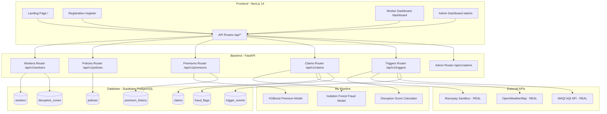
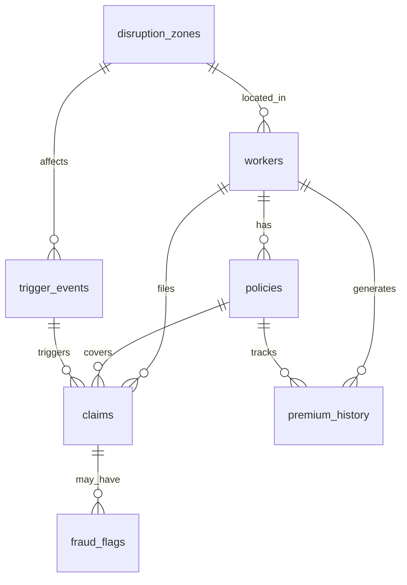

# GigShield Phase 2 - Design Document

## System Architecture Overview

GigShield follows a modern serverless architecture with clear separation between frontend, backend, database, and ML components.

### Architecture Diagram



## Frontend Architecture

### Technology Stack
- **Framework:** Next.js 14 with App Router
- **Styling:** Tailwind CSS
- **Components:** Shadcn UI (customized)
- **Maps:** Leaflet.js + OpenStreetMap
- **State Management:** React Context + Server Components
- **Deployment:** Vercel (free tier)

### Route Structure

```
/app
├── page.tsx                    # Landing page
├── register
│   └── page.tsx               # Worker registration form
├── dashboard
│   └── page.tsx               # Worker dashboard (policy, claims, premium)
├── admin
│   └── page.tsx               # Admin dashboard (forecast, heatmap, reserves)
└── api
    ├── workers
    │   └── route.ts           # Proxy to FastAPI /api/v1/workers
    ├── policies
    │   └── route.ts           # Proxy to FastAPI /api/v1/policies
    ├── premiums
    │   └── route.ts           # Proxy to FastAPI /api/v1/premiums
    ├── claims
    │   └── route.ts           # Proxy to FastAPI /api/v1/claims
    ├── triggers
    │   └── route.ts           # Proxy to FastAPI /api/v1/triggers
    └── admin
        └── route.ts           # Proxy to FastAPI /api/v1/admin
```

### Component Hierarchy

```
/components
├── ui/                        # Shadcn UI components
│   ├── button.tsx
│   ├── card.tsx
│   ├── input.tsx
│   ├── select.tsx
│   ├── badge.tsx
│   └── ...
├── registration-form.tsx      # Worker registration form
├── policy-card.tsx            # Policy details card
├── premium-breakdown.tsx      # Visual premium breakdown
├── claims-timeline.tsx        # Claims status timeline
├── trigger-card.tsx           # Trigger event card
├── fraud-heatmap.tsx          # Leaflet.js fraud heatmap
├── claims-forecast.tsx        # 7-day claims forecast chart
├── reserve-panel.tsx          # Reserve recommendations
└── guidewire-badge.tsx        # Guidewire integration indicator
```

## Backend Architecture

### Technology Stack
- **Framework:** Python FastAPI
- **Database Client:** Supabase Python SDK
- **ML Libraries:** XGBoost, scikit-learn, pandas, numpy
- **HTTP Client:** httpx (for external APIs)
- **Deployment:** Vercel Serverless Functions (Python runtime)

### Router Modules

```python
# /backend/routers/workers.py
@router.post("/register")
async def register_worker(worker: WorkerCreate) -> WorkerResponse:
    """
    Register new delivery worker
    - Validates input data
    - Creates worker record in database
    - Auto-creates policy
    - Calculates initial premium
    - Returns worker_id, policy_id, weekly_premium
    """

# /backend/routers/policies.py
@router.post("/create")
async def create_policy(policy: PolicyCreate) -> PolicyResponse:
    """
    Create insurance policy
    - [MOCK/SIMULATED] Simulates Guidewire PolicyCenter
    - Generates unique policy number
    - Sets 7-day coverage period
    - Stores in policies table
    """

@router.get("/{worker_id}")
async def get_policy(worker_id: str) -> PolicyDetail:
    """Get worker's current policy with claims summary"""

@router.post("/{policy_id}/renew")
async def renew_policy(policy_id: str) -> PolicyResponse:
    """
    Renew policy for another week
    - Recalculates premium with updated risk factors
    - [MOCK/SIMULATED] Simulates Guidewire BillingCenter
    """

# /backend/routers/premiums.py
@router.post("/calculate")
async def calculate_premium(features: PremiumFeatures) -> PremiumResponse:
    """
    Calculate personalized weekly premium using XGBoost
    - Loads trained model from /backend/ml/models/
    - Applies 7 input features
    - Returns premium with breakdown
    - Enforces affordability ceiling (3% of earnings)
    """

@router.get("/{worker_id}/breakdown")
async def get_premium_breakdown(worker_id: str) -> PremiumBreakdown:
    """Get visual breakdown of premium factors"""

# /backend/routers/claims.py
@router.post("/auto-create")
async def auto_create_claim(claim: ClaimCreate) -> ClaimResponse:
    """
    Auto-create claim from trigger event
    - [MOCK/SIMULATED] Simulates Guidewire ClaimCenter FNOL
    - Runs fraud detection checks
    - Approves or flags for review
    - Triggers payout if approved
    """

@router.get("/{worker_id}")
async def get_claims(worker_id: str) -> List[ClaimSummary]:
    """Get all claims for a worker"""

@router.get("/{claim_id}/detail")
async def get_claim_detail(claim_id: str) -> ClaimDetail:
    """Get detailed claim information with fraud flags"""

@router.post("/{claim_id}/payout")
async def process_payout(claim_id: str) -> PayoutResponse:
    """
    Process payout via Razorpay Sandbox
    - [REAL API] Razorpay test mode
    - Simulates UPI transfer
    - Updates claim status to 'paid'
    """

# /backend/routers/triggers.py
@router.get("/check")
async def check_triggers() -> TriggerCheckResponse:
    """
    Check current conditions for all zones
    - [REAL API] Calls OpenWeatherMap for weather data
    - [REAL API] Calls WAQI for AQI data
    - [MOCK/SIMULATED] Checks seeded bandh events
    - Calculates compound disruption score
    - Returns zones with active triggers
    """

@router.post("/fire")
async def fire_trigger(trigger: TriggerEvent) -> TriggerResponse:
    """
    Manually fire a trigger (admin/testing)
    - Creates trigger_event record
    - Finds affected workers in zone
    - Auto-creates claims for eligible workers
    """

@router.get("/history")
async def get_trigger_history(zone_id: str = None) -> List[TriggerEvent]:
    """Get historical trigger events"""

# /backend/routers/admin.py
@router.get("/claims-forecast")
async def get_claims_forecast() -> ClaimsForecast:
    """
    7-day claims forecast
    - [REAL API] Uses OpenWeatherMap 7-day forecast
    - Predicts trigger probabilities
    - Estimates claims count and payout
    """

@router.get("/fraud-heatmap")
async def get_fraud_heatmap() -> FraudHeatmap:
    """
    Geographic fraud risk heatmap
    - Runs Isolation Forest model on zone-level data
    - Returns zones with fraud scores
    """

@router.get("/reserves")
async def get_reserves() -> ReserveRecommendation:
    """
    Reserve recommendations
    - Calculates required reserves based on forecast
    - Compares to current balance
    - Returns status and recommendation
    """
```

## Database Schema Design

### Supabase PostgreSQL Tables

```sql
-- workers table
CREATE TABLE workers (
  id UUID PRIMARY KEY DEFAULT gen_random_uuid(),
  name VARCHAR(255) NOT NULL,
  phone VARCHAR(64) NOT NULL UNIQUE,
  platform VARCHAR(50) NOT NULL,
  city VARCHAR(100) NOT NULL,
  zone VARCHAR(100) NOT NULL,
  worker_id VARCHAR(50) NOT NULL UNIQUE,
  rating DECIMAL(2,1) NOT NULL CHECK (rating >= 1.0 AND rating <= 5.0),
  avg_weekly_hours INTEGER NOT NULL CHECK (avg_weekly_hours >= 10 AND avg_weekly_hours <= 80),
  baseline_weekly_earnings INTEGER NOT NULL CHECK (baseline_weekly_earnings >= 1000 AND baseline_weekly_earnings <= 15000),
  created_at TIMESTAMP DEFAULT NOW(),
  updated_at TIMESTAMP DEFAULT NOW()
);

CREATE INDEX idx_workers_zone ON workers(zone);
CREATE INDEX idx_workers_city ON workers(city);

-- policies table
CREATE TABLE policies (
  id UUID PRIMARY KEY DEFAULT gen_random_uuid(),
  policy_number VARCHAR(50) NOT NULL UNIQUE,
  worker_id UUID NOT NULL REFERENCES workers(id) ON DELETE CASCADE,
  start_date DATE NOT NULL,
  end_date DATE NOT NULL,
  status VARCHAR(20) NOT NULL DEFAULT 'active',
  weekly_premium INTEGER NOT NULL,
  coverage_amount INTEGER NOT NULL,
  created_at TIMESTAMP DEFAULT NOW(),
  updated_at TIMESTAMP DEFAULT NOW()
);

CREATE INDEX idx_policies_worker ON policies(worker_id);
CREATE INDEX idx_policies_status ON policies(status);
-- claims table
CREATE TABLE claims (
  id UUID PRIMARY KEY DEFAULT gen_random_uuid(),
  claim_number VARCHAR(50) NOT NULL UNIQUE,
  worker_id UUID NOT NULL REFERENCES workers(id) ON DELETE CASCADE,
  policy_id UUID NOT NULL REFERENCES policies(id) ON DELETE CASCADE,
  trigger_type VARCHAR(50) NOT NULL,
  trigger_timestamp TIMESTAMP NOT NULL,
  payout_amount INTEGER NOT NULL,
  status VARCHAR(20) NOT NULL DEFAULT 'pending',
  fraud_score DECIMAL(3,2) DEFAULT 0.0,
  approved_at TIMESTAMP,
  paid_at TIMESTAMP,
  transaction_id VARCHAR(100),
  created_at TIMESTAMP DEFAULT NOW()
);

CREATE INDEX idx_claims_worker ON claims(worker_id);
CREATE INDEX idx_claims_status ON claims(status);
CREATE INDEX idx_claims_trigger_timestamp ON claims(trigger_timestamp);

-- premium_history table
CREATE TABLE premium_history (
  id UUID PRIMARY KEY DEFAULT gen_random_uuid(),
  worker_id UUID NOT NULL REFERENCES workers(id) ON DELETE CASCADE,
  policy_id UUID NOT NULL REFERENCES policies(id) ON DELETE CASCADE,
  calculated_premium INTEGER NOT NULL,
  base_premium INTEGER NOT NULL DEFAULT 159,
  multiplier DECIMAL(3,2) NOT NULL,
  features_json JSONB NOT NULL,
  calculated_at TIMESTAMP DEFAULT NOW()
);

CREATE INDEX idx_premium_history_worker ON premium_history(worker_id);

-- trigger_events table
CREATE TABLE trigger_events (
  id UUID PRIMARY KEY DEFAULT gen_random_uuid(),
  trigger_type VARCHAR(50) NOT NULL,
  zone_id VARCHAR(100) NOT NULL,
  city VARCHAR(100) NOT NULL,
  timestamp TIMESTAMP NOT NULL,
  duration_hours DECIMAL(4,2) NOT NULL,
  intensity_value DECIMAL(6,2) NOT NULL,
  source_api VARCHAR(50) NOT NULL,
  affected_workers_count INTEGER DEFAULT 0,
  event_hash VARCHAR(64) NOT NULL UNIQUE,
  created_at TIMESTAMP DEFAULT NOW()
);

CREATE INDEX idx_trigger_events_zone ON trigger_events(zone_id);
CREATE INDEX idx_trigger_events_timestamp ON trigger_events(timestamp);
CREATE INDEX idx_trigger_events_hash ON trigger_events(event_hash);

-- disruption_zones table
CREATE TABLE disruption_zones (
  id UUID PRIMARY KEY DEFAULT gen_random_uuid(),
  city VARCHAR(100) NOT NULL,
  zone_name VARCHAR(100) NOT NULL,
  lat DECIMAL(9,6) NOT NULL,
  lon DECIMAL(9,6) NOT NULL,
  flood_risk_score DECIMAL(3,2) NOT NULL CHECK (flood_risk_score >= 0 AND flood_risk_score <= 1),
  aqi_risk_score DECIMAL(3,2) NOT NULL CHECK (aqi_risk_score >= 0 AND aqi_risk_score <= 1),
  UNIQUE(city, zone_name)
);

CREATE INDEX idx_zones_city ON disruption_zones(city);

-- fraud_flags table
CREATE TABLE fraud_flags (
  id UUID PRIMARY KEY DEFAULT gen_random_uuid(),
  claim_id UUID NOT NULL REFERENCES claims(id) ON DELETE CASCADE,
  flag_type VARCHAR(50) NOT NULL,
  severity VARCHAR(20) NOT NULL,
  details_json JSONB NOT NULL,
  flagged_at TIMESTAMP DEFAULT NOW()
);

CREATE INDEX idx_fraud_flags_claim ON fraud_flags(claim_id);
CREATE INDEX idx_fraud_flags_severity ON fraud_flags(severity);
```

### Entity Relationships



## ML Pipeline Design

### XGBoost Premium Model

**Purpose:** Calculate personalized weekly premium based on 7 risk factors

**Input Features:**
1. `city` (one-hot encoded: Mumbai, Delhi, Bengaluru)
2. `month` (1-12, captures seasonality)
3. `worker_weekly_baseline_inr` (1000-15000)
4. `zone_flood_risk_score` (0-1)
5. `zone_aqi_risk_score` (0-1)
6. `platform_rating` (1-5)
7. `avg_weekly_hours_logged` (10-80)

**Output:**
- `multiplier` (0.5 to 2.0)
- Applied to base premium (Rs.159/week)
- Final premium range: Rs.80 to Rs.318/week

**Training Data:**
- Initially synthetic (1000 samples)
- Retrained weekly as real claims accumulate
- Features stored in `premium_history.features_json`

**Model File:**
- `/backend/ml/models/premium_xgboost.pkl`

**Training Script:**
- `/backend/ml/train_premium_model.py`

```python
# Pseudocode
import xgboost as xgb
import pandas as pd

def train_premium_model():
    # Load training data
    df = load_synthetic_data()  # or load from premium_history
    
    # Prepare features
    X = prepare_features(df)
    y = df['multiplier']
    
    # Train XGBoost
    model = xgb.XGBRegressor(
        max_depth=5,
        learning_rate=0.1,
        n_estimators=100,
        objective='reg:squarederror'
    )
    model.fit(X, y)
    
    # Save model
    model.save_model('/backend/ml/models/premium_xgboost.pkl')
```

### Isolation Forest Fraud Model

**Purpose:** Detect anomalous claim patterns for fraud prevention

**Input Features:**
- Claim frequency per worker
- Payout amount deviation from zone average
- Time between claims
- Zone correlation score
- GPS distance from trigger zone

**Output:**
- Anomaly score (-1 to 1)
- Scores <0 flagged as potential fraud

**Training:**
- Unsupervised learning
- Retrained as claims accumulate
- No labeled fraud data required initially

**Model File:**
- `/backend/ml/models/fraud_isolation_forest.pkl`

### Disruption Score Calculator

**Purpose:** Calculate compound disruption score when no single trigger fires

**Formula:**
```python
score = (rain_intensity * 2.5) + (temp_deviation * 1.8) + (aqi_level * 2.0) + (traffic_index * 1.5)
```

**Trigger Threshold:**
- Score >7.0 for 2+ hours
- Payout: Rs.300

**Implementation:**
- `/backend/ml/disruption_score.py`

## Integration Design

### Real API Integrations

#### OpenWeatherMap One Call 3.0
**[REAL API]**

**Endpoint:** `https://api.openweathermap.org/data/3.0/onecall`

**Parameters:**
- `lat`, `lon` (from disruption_zones table)
- `appid` (API key from environment variable)
- `units=metric`

**Response Used:**
- `current.rain.1h` (rainfall in mm)
- `current.temp` (temperature in °C)
- `current.feels_like` (feels like temperature)
- `hourly[]` (3-hour window for cumulative rain)

**Rate Limit:** 1000 calls/day (free tier)

**Polling Strategy:**
- Check every 15 minutes during peak hours (6am-11pm)
- 3 cities × 5 zones × 4 calls/hour = 60 calls/hour = 960 calls/day

#### WAQI API
**[REAL API]**

**Endpoint:** `https://api.waqi.info/feed/{city}/?token={token}`

**Response Used:**
- `data.aqi` (AQI value)
- `data.time.s` (timestamp)

**Rate Limit:** Unlimited with rate limiting

**Polling Strategy:**
- Check every 30 minutes
- 3 cities × 2 calls/hour = 48 calls/day

#### Razorpay Sandbox
**[REAL API - Test Mode]**

**Endpoint:** `https://api.razorpay.com/v1/payouts`

**Authentication:** Basic Auth with test API keys

**Request:**
```json
{
  "account_number": "test_account",
  "fund_account_id": "fa_test",
  "amount": 30000,
  "currency": "INR",
  "mode": "UPI",
  "purpose": "payout",
  "queue_if_low_balance": true
}
```

**Response:**
- `id` (transaction ID)
- `status` (processing/processed/failed)

### Mocked/Simulated Integrations

#### Guidewire InsuranceSuite
**[MOCK/SIMULATED]**

**Production Mapping:**
- `policies` table → Guidewire PolicyCenter REST API
- `claims` table → Guidewire ClaimCenter REST API
- `premium_history` table → Guidewire BillingCenter REST API

**Mock Implementation:**
- Direct database operations simulate Guidewire behavior
- UI displays "Guidewire Integration" badges
- Documentation explains production API mapping

**Example Production Endpoint:**
```
POST https://guidewire-instance.com/pc/rest/v1/policies
POST https://guidewire-instance.com/cc/rest/v1/claims
POST https://guidewire-instance.com/bc/rest/v1/invoices
```

#### Swiggy/Zomato Partner API
**[MOCK/SIMULATED]**

**Mock Data Generation:**
- Worker GPS: Selected from dropdown, stored in `workers.zone`
- Order count: Calculated from `baseline_weekly_earnings / 40` (avg Rs.40/order)
- Active status: Simulated based on time of day and historical patterns

**Seed Data:**
- `/backend/seeds/mock_workers.json`
- 10-15 workers per city with realistic profiles

#### Government Bandh Alerts
**[MOCK/SIMULATED]**

**Mock Implementation:**
- Bandh events seeded in `trigger_events` table
- Admin button to manually trigger bandh event
- Simulates NDMA/state government alert system

**Seed Data:**
- `/backend/seeds/mock_bandh_events.json`

## UI/UX Design

### Design System

**Typography:**
- Font: Inter (Google Fonts)
- Sizes: 12px (caption), 14px (body), 16px (subheading), 20px (heading), 28px (title)

**Color Palette:**
- Primary: Indigo-500 (#6366f1)
- Surface Dark: Slate-900 (#0f172a)
- Surface Light: Slate-800 (#1e293b)
- Success: Emerald-500 (#10b981)
- Warning: Amber-500 (#f59e0b)
- Danger: Rose-500 (#f43f5e)
- Text Primary: White (#ffffff)
- Text Secondary: Slate-400 (#94a3b8)

**Spacing:**
- Base unit: 4px
- Common: 8px, 12px, 16px, 24px, 32px, 48px

**Border Radius:**
- Cards: 12px
- Buttons: 8px
- Inputs: 6px

**Shadows:**
- Card: `0 4px 6px -1px rgba(0, 0, 0, 0.3)`
- Button hover: `0 10px 15px -3px rgba(0, 0, 0, 0.3)`

### Page Layouts

#### Landing Page (/)
```
┌─────────────────────────────────────┐
│  GigShield Logo                     │
│                                     │
│  India's First Weekly Income Shield │
│  for Delivery Partners              │
│                                     │
│  [Register Now] [Learn More]       │
│                                     │
│  ✓ Zero paperwork                  │
│  ✓ Auto payouts in 2 hours         │
│  ✓ Rs.80-318/week                  │
└─────────────────────────────────────┘
```

#### Registration Page (/register)
```
┌─────────────────────────────────────┐
│  Register for GigShield             │
│                                     │
│  [Name Input]                       │
│  [Phone Input]                      │
│  [Platform Dropdown]                │
│  [City Dropdown]                    │
│  [Zone Dropdown]                    │
│  [Worker ID Input]                  │
│  [Rating Slider 1-5]                │
│  [Weekly Hours Slider]              │
│  [Baseline Earnings Input]          │
│                                     │
│  Your Premium: Rs.XXX/week          │
│                                     │
│  [Submit Registration]              │
└─────────────────────────────────────┘
```

#### Worker Dashboard (/dashboard)
```
┌─────────────────────────────────────┐
│  Welcome, [Name]                    │
│                                     │
│  ┌─────────────────────────────┐   │
│  │ Policy Card                 │   │
│  │ Policy: GS-2026-MUM-123456 │   │
│  │ Coverage: Rs.XXXX          │   │
│  │ Premium: Rs.XXX/week       │   │
│  │ [Guidewire Badge]          │   │
│  └─────────────────────────────┘   │
│                                     │
│  ┌─────────────────────────────┐   │
│  │ Premium Breakdown           │   │
│  │ [Visual bars for factors]   │   │
│  └─────────────────────────────┘   │
│                                     │
│  ┌─────────────────────────────┐   │
│  │ Claims Timeline             │   │
│  │ [WhatsApp-style cards]      │   │
│  └─────────────────────────────┘   │
└─────────────────────────────────────┘
```

#### Admin Dashboard (/admin)
```
┌─────────────────────────────────────┐
│  Admin Dashboard                    │
│                                     │
│  ┌─────────────────────────────┐   │
│  │ 7-Day Claims Forecast       │   │
│  │ [Line chart]                │   │
│  └─────────────────────────────┘   │
│                                     │
│  ┌─────────────────────────────┐   │
│  │ Fraud Risk Heatmap          │   │
│  │ [Leaflet.js map]            │   │
│  └─────────────────────────────┘   │
│                                     │
│  ┌─────────────────────────────┐   │
│  │ Reserve Recommendations     │   │
│  │ Current: Rs.XXX             │   │
│  │ Required: Rs.XXX            │   │
│  │ Status: [Traffic light]     │   │
│  └─────────────────────────────┘   │
└─────────────────────────────────────┘
```

### Mobile-First Principles

1. **Large Touch Targets:** Minimum 44x44px for all interactive elements
2. **Thumb-Friendly Navigation:** Bottom navigation bar for primary actions
3. **Minimal Text Input:** Use dropdowns, sliders, and toggles instead
4. **Dark Theme Default:** Reduces eye strain for night deliveries
5. **Offline-First:** Cache policy and claims data for offline viewing
6. **Progressive Disclosure:** Show essential info first, details on tap

### Accessibility Features

- **Keyboard Navigation:** All interactive elements accessible via Tab
- **Screen Reader Support:** ARIA labels on all components
- **High Contrast Mode:** Toggle for visually impaired users
- **Language Toggle:** Hindi + English support
- **Font Scaling:** Respects system font size settings

## API Contract Design

### Request/Response Formats

All APIs use JSON format with consistent structure:

**Success Response:**
```json
{
  "status": "success",
  "data": { ... },
  "timestamp": "2026-04-02T10:30:00Z"
}
```

**Error Response:**
```json
{
  "status": "error",
  "error": {
    "code": "VALIDATION_ERROR",
    "message": "Invalid phone number format",
    "details": { ... }
  },
  "timestamp": "2026-04-02T10:30:00Z"
}
```

### Authentication

**JWT Token-Based:**
- Token issued after worker registration
- Stored in httpOnly cookie
- Expires after 7 days
- Refresh token for renewal

**Header:**
```
Authorization: Bearer <jwt_token>
```

### Rate Limiting

- 100 requests/minute per IP
- 429 status code when exceeded
- Retry-After header with seconds to wait

## Deployment Architecture

### Vercel Deployment

**Frontend:**
- Next.js 14 App Router
- Automatic builds on git push
- Edge functions for API routes
- CDN for static assets

**Backend:**
- FastAPI as Vercel Serverless Functions
- Python 3.11 runtime
- Cold start optimization with function warming

**Environment Variables:**
```
SUPABASE_URL=https://xxx.supabase.co
SUPABASE_KEY=xxx
OPENWEATHERMAP_API_KEY=xxx
WAQI_API_TOKEN=xxx
RAZORPAY_KEY_ID=xxx
RAZORPAY_KEY_SECRET=xxx
JWT_SECRET=xxx
```

### Database Hosting

**Supabase Free Tier:**
- 500MB database storage
- Unlimited API requests
- Automatic backups
- Real-time subscriptions (optional)

## Performance Optimization

1. **Database Indexing:** All foreign keys and frequently queried fields indexed
2. **API Response Caching:** 5-minute cache for trigger checks
3. **Image Optimization:** Next.js Image component with WebP format
4. **Code Splitting:** Dynamic imports for admin dashboard
5. **Lazy Loading:** Claims timeline loads on scroll

## Security Measures

1. **Input Validation:** Pydantic models for all API inputs
2. **SQL Injection Prevention:** Parameterized queries via Supabase SDK
3. **XSS Protection:** React auto-escapes user input
4. **CSRF Protection:** SameSite cookies
5. **API Key Security:** Environment variables, never committed
6. **Phone Number Hashing:** SHA256 before storage

---

**Document Version:** 1.0  
**Last Updated:** April 2, 2026  
**Status:** Final for Phase 2 Implementation
